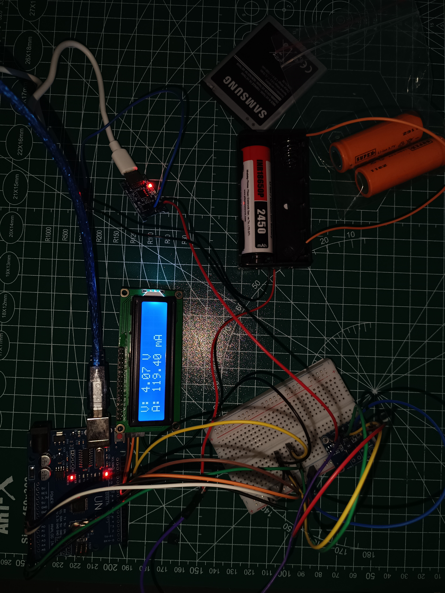

# 🔋 Batarya Şarj ve Kontrol Modülü (Li-ion Charger & Lcd Monitor)

Bu proje; [cite_start]Li-ion pillerin (18650, 18500 ve mobil cihaz bataryaları) güvenli bir şekilde şarj edilmesini sağlarken, anlık akım ve voltaj değerlerini dijital bir ekran üzerinden takip etmeyi amaçlar[cite: 1, 2, 20].

## 🚀 Proje Amacı
[cite_start]Özellikle şarj girişi arızalı olan eski telefon bataryalarını veya standart dışı Li-ion hücreleri dışarıdan kontrollü bir şekilde doldurmak ve pilin sağlık durumunu anlık verilerle (V/mA) izlemek için geliştirilmiştir[cite: 2, 20].

## 🛠 Donanım Bileşenleri
* [cite_start]**Mikrodenetleyici:** Arduino Uno[cite: 19].
* [cite_start]**Şarj Modülü:** TP4056 (5V / 1A)[cite: 14, 15].
* [cite_start]**Sensör:** INA219 Hassas Akım ve Voltaj Sensörü[cite: 11].
* [cite_start]**Ekran:** 16x2 I2C LCD Ekran[cite: 5].
* [cite_start]**Güç Kaynağı:** 5V Adaptör veya Powerbank (Laptop üzerinden besleme yapılabilir)[cite: 9, 21].

## 📊 Teknik Veriler ve Bağlantılar
Sistem I2C haberleşme protokolünü kullanır. Bağlantı şeması ve detayları aşağıdadır:

| Bileşen | Pin (SDA) | Pin (SCL) | Besleme |
| :--- | :--- | :--- | :--- |
| **LCD Ekran** | A4 | A5 | [cite_start]VCC / GND [cite: 6] |
| **INA219** | A4 | A5 | [cite_start]VCC / GND [cite: 7] |

> [cite_start]**Bağlantı Notu:** TP4056 çıkışları (B+/B-), INA219 üzerinden geçerek pil yatağına bağlanır[cite: 7, 8].

## ⚠️ Önemli Tavsiyeler
* [cite_start]**Lehimleme:** Bağlantıların kopmaması ve ölçüm doğruluğu için krokodil yerine lehimleme tercih edilmelidir[cite: 13].
* [cite_start]**Besleme Gerilimi:** Devreye 5V üzerinde gerilim verilmemesi kritik önem taşır; aksi takdirde modüller zarar görebilir[cite: 21].
* [cite_start]**Geliştirme:** Daha hızlı şarj süreleri için TP5100 gibi yüksek akımlı modüller sisteme entegre edilebilir[cite: 15].

## ✍️ Hazırlayan
**Muhammed Said Karaahmetoğlu**
*Robotics & AI Student*
