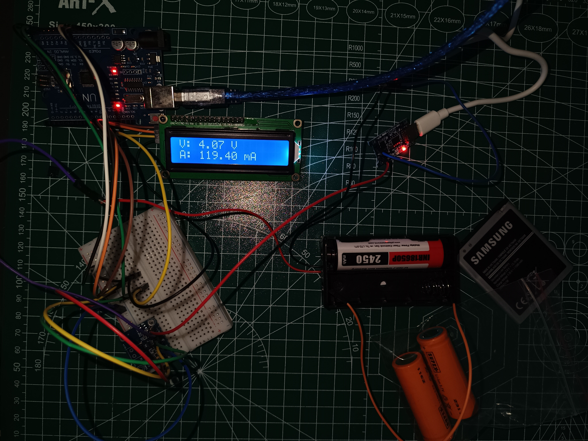

# 🔋 Batarya Şarj ve Kontrol Modülü (Li-ion Charger & Lcd Monitor)

Bu proje; Li-ion pillerin (18650, 18500 ve mobil cihaz bataryaları) güvenli bir şekilde şarj edilmesini sağlarken, anlık akım ve voltaj değerlerini dijital bir ekran üzerinden takip etmeyi amaçlar.

### 🚀 Proje Amacı
Özellikle şarj girişi arızalı olan eski telefon bataryalarını veya standart dışı Li-ion hücreleri dışarıdan kontrollü bir şekilde doldurmak ve pilin sağlık durumunu anlık verilerle (V/mA) izlemek için geliştirilmiştir.

### 🛠 Donanım Bileşenleri
* **Mikrodenetleyici:** Arduino Uno.
* **Şarj Modülü:** TP4056 (5V / 1A).
* **Sensör:** INA219 Hassas Akım ve Voltaj Sensörü.
* **Ekran:** 16x2 I2C LCD Ekran.
* **Güç Kaynağı:** 5V Adaptör veya Powerbank (Laptop üzerinden besleme yapılabilir).

### 📊 Teknik Veriler ve Bağlantılar
Sistem I2C haberleşme protokolünü kullanır. Bağlantı şeması ve detayları aşağıdadır:

| Bileşen | Pin (SDA) | Pin (SCL) | Besleme |
| :--- | :--- | :--- | :--- |
| **LCD Ekran** | A4 | A5 | VCC / GND |
| **INA219** | A4 | A5 | VCC / GND |

> **Bağlantı Notu:** TP4056 çıkışları (B+/B-), INA219 üzerinden geçerek pil yatağına bağlanır.

### ⚠️ Önemli Tavsiyeler
* **Lehimleme:** Bağlantıların kopmaması ve ölçüm doğruluğu için krokodil yerine lehimleme tercih edilmelidir.
* **Besleme Gerilimi:** Devreye 5V üzerinde gerilim verilmemesi kritik önem taşır; aksi takdirde modüller zarar görebilir.
* **Geliştirme:** Daha hızlı şarj süreleri için TP5100 gibi yüksek akımlı modüller sisteme entegre edilebilir.

### ✍️ Hazırlayan
**Muhammed Said Karaahmetoğlu**
*24/03/2026*
